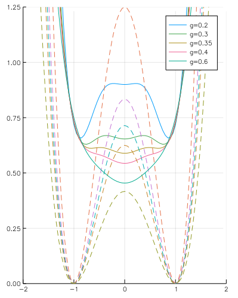

# FeynmanKleinert

## A work in progress - beware, dragons!

These codes implement Feynman and Klenert's 1986 PRA "Effective classical
partition function" methods. 
This method addsc quantum effects to a classical potential, by simply smearing the bare potential with a Gaussian kernel. 

The clever bit is in solving the quantum problem with path integration. The full integrals cannot be calculated exactly, but a an approximate harmonic integral can be solved exactly. As with Feynman's polaron solution, a variational connection is made, allowing one freedom to vary the parameters of the approximate harmonic system to minimise a free energy. Having done this, you have an 'effective classical potential' (W) which can be integrated over to get the partition function, etc. 

This method contains most of the quantum-fuzziness, but misses out details of the state symmetry and tunnelling behaviour. This is most notable in the errors for the ground state. 

In Gribbin's biography (see
[http://users.physik.fu-berlin.de/~kleinert/kleinert/?p=feynman]), it's
mentioned that they used a Sinclair ZX Spectrum to run the codes on. This is
the same computer I learnt to program with. I fear I'm rather using
a sledgehammer to crack a walnut, turning the power of Julia and automatic
differentiation against the poor thing!

But at least we can plot the figures in colour these days.

My motivation to do this is:
 - because it's cool
 - this might be useful
   - initially for calculating tunnelling and delocalisation of the nuclear
     wavefunction in double wells (dynamic stabilisation of soft modes in
     perovskites)
   - the idea of smearing out the potential, is exactly what I've been doing
     for semi-classical models of recombination
   - maybe it could be extended to n-dimensional problems, such as a full set
     of anharmonic phonons
   - I believe it forms the core of the 'centroid' approximation in Path 
     Integral MC, which I do not understand, but would like to.

### Literature

Central paper is [https://doi.org/10.1103/PhysRevA.34.5080 ]
Effective classical partition functions.
R. P. Feynman and H. Kleinert. 
Phys. Rev. A 34, 5080.  Published 1 December 1986

This introduces the method, which grows out of the variational approach described in referenced 1 therein, which is the Path Integral book by Feynman and Hibbs (section 10.3, as referenced within the text). 
Here they apply the method to two test cases of an anharmonic potential, and a double well potential. They also mention applying it to singular potentials, briefly give a Green's Function for response to an external perturbation, and show how it can be generalised to higher dimensions. 

Kleinert followed this up with two publications in the early 1990s, which added higher-order diagrams and significantly reduced the error for the ground state. 

H. Kleinert
Improving the Variational Approach to Path Integrals
Phys. Lett. B 280, 251 (1992)

and

H. Kleinert
Systematic Corrections to Variational Calculation of Effective Classical
Potential
Phys. Lett. A 173, 332 (1993)

### Errata 
[https://doi.org/10.1103/PhysRevA.34.5080 ]
Effective classical partition functions.
R. P. Feynman and H. Kleinert. 
Phys. Rev. A 34, 5080.

The form for the double well potential (page 34, RHS, third paragraph starting 'Another example is the double-well...'), should read

`V(x)=-\frac{1}{2} x^2 + \frac{1}{4} g x^4 + \frac{1}{4g}`.

Strangely this is correct in the captions of figure 2 and 3!
